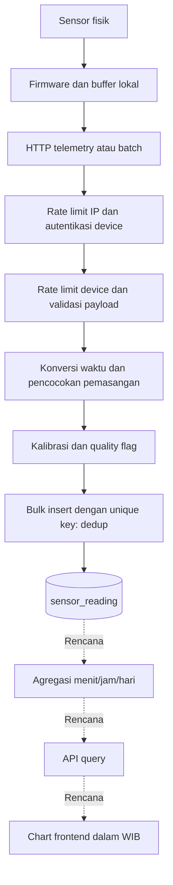

# Jawaban Pertanyaan Desain A–E

Sumber pertanyaan: `Tes Teknis Fullstack Developer - Luwes Inovasi Mandiri.pdf`, bagian A–E. `ERD_Weather_Monitoring.pdf` hanya memuat diagram database. Jawaban berikut membedakan kode yang tersedia dan rancangan yang belum diimplementasikan.

## A. Device Management

### 1. Apa yang terjadi pada data historis saat device di-decommission?

Data historis tetap disimpan untuk audit dan analisis; decommission hanya menghentikan penerimaan data baru. Relasi pembacaan tetap mengacu ke pemasangan lama, dan perubahan status dicatat pada `device_status_history`. Soft delete menggunakan `deleted_at`, sehingga tidak menghapus pembacaan.

**Kode:** [updateDevice dan softDeleteDevice](../services/deviceService.js); [deviceAuth](../middlewares/deviceAuth.js) menolak device `DECOMMISSIONED` dengan HTTP 403. Riwayat status sudah tersedia, tetapi aturan transisi status yang diizinkan belum dibatasi dalam service.

### 2. Bagaimana membedakan device mati dan jaringan putus?

Tanpa komunikasi tambahan, backend hanya dapat menyatakan device tidak terhubung, bukan memastikan penyebabnya. Gunakan `last_seen_at` untuk mendeteksi tidak ada kiriman selama X menit; setelah tersambung, buffered reading dan `uptime_s` membantu menilai apakah device tetap hidup atau restart. Tegangan baterai dan RSSI memberi petunjuk tambahan, tetapi bukan bukti pasti.

**Kode:** [updateDeviceHealth dan ingestHeartbeat](../services/ingestService.js). `lastSeenAt` mengikuti waktu penerimaan, sementara metadata mengikuti event terbaru; endpoint health khusus device belum tersedia.

## B. Sensor Management

### 1. Sensor dipindah dari A ke B pada 1 Juni: bagaimana data lama tetap milik A?

Tutup pemasangan A dengan `removed_at = 1 Juni`, lalu buat pemasangan B dengan `installed_at = 1 Juni`; jangan mengganti `device_id` pada pemasangan lama. Pembacaan menyimpan `installation_id`, sehingga data sebelum perpindahan tetap terhubung ke A. Data terlambat dicocokkan dengan periode `installed_at ≤ device_time < removed_at`, bukan pemasangan saat request diterima.

**Kode:** model `SensorInstallation` dan `SensorReading` di [schema.prisma](../prisma/schema.prisma); fungsi `prepareRecord` di [ingestService.js](../services/ingestService.js). Endpoint pasang/lepas sensor belum tersedia.

### 2. Kalibrasi diubah hari ini: apakah data lama ikut berubah?

Tidak; setiap pembacaan menyimpan `raw_value`, `corrected_value`, dan `calibration_id` yang berlaku saat pengukuran. Pemrosesan memilih kalibrasi terbaru dengan `effective_from ≤ device_time`, lalu menghitung `corrected = raw × scale + offset`. Hasil historis tetap konsisten dan dapat diaudit, tetapi koreksi ulang historis memerlukan proses terpisah; endpoint untuk menambah versi kalibrasi belum tersedia.

**Kode:** `prepareRecord` di [ingestService.js](../services/ingestService.js) dan `correctReading` di [ingestProcessing.js](../utils/ingestProcessing.js).

## C. ERD dan Pertumbuhan Data

### 1. Tabel mana paling cepat tumbuh, dan berapa baris per tahun?

`sensor_reading` tumbuh paling cepat karena satu pembacaan sensor menjadi satu baris. Dengan tahun 365 hari: **50 × 7 × 60 × 24 × 365 = 183.960.000 baris/tahun**, atau 504.000 baris/hari. Angka ini belum menghitung ukuran index dan tabel pendukung.

**Kode:** model `SensorReading` di [schema.prisma](../prisma/schema.prisma); `prepareRecord` menghasilkan satu baris per sensor yang dikirim.

### 2. Strategi pertumbuhan dan trade-off-nya?

Saya memilih partisi bulanan berdasarkan `device_time` pada PostgreSQL: query rentang waktu dapat melewati partisi yang tidak relevan, dan penghapusan periode lama dapat dilakukan per partisi. Trade-off-nya adalah pengelolaan partisi, penanganan data terlambat, serta penyesuaian constraint. Unique `(installation_id, device_time)` sudah mencakup kolom partisi, tetapi primary key `id` perlu diubah agar menyertakan `device_time`; partisi belum diterapkan pada migration saat ini.

**Kode saat ini:** [schema.prisma](../prisma/schema.prisma) dan [migration awal](../prisma/migrations/20261006000100_init/migration.sql).

### 3. Mengapa memilih narrow/long dibanding wide?

Saya memilih narrow: satu baris per sensor, sehingga penambahan tipe sensor tidak memerlukan kolom baru dan riwayat pemasangan serta kalibrasi mudah dilacak. Wide lebih hemat jumlah baris dan mudah mengambil seluruh sensor pada satu waktu, tetapi menghasilkan kolom kosong saat sensor tidak dikirim dan kurang fleksibel ketika sensor diganti. Narrow membutuhkan lebih banyak baris dan pivot/join untuk menampilkan semua sensor sekaligus.

**Kode:** model `SensorReading` di [schema.prisma](../prisma/schema.prisma) dan `prepareRecord` di [ingestService.js](../services/ingestService.js).

### 4. Alasan index dan kardinalitas relasi

Index eksplisit dalam schema melayani query berikut; manfaat aktualnya perlu diperiksa menggunakan `EXPLAIN ANALYZE`.

| Tabel | Index | Query/alasan |
|---|---|---|
| `device` | `location_id` | Filter device per lokasi. |
| `device` | `status` | Filter status lifecycle. |
| `device` | `last_seen_at` | Pencarian device yang tidak mengirim sejak batas waktu. |
| `device` | `(status, deleted_at)` | Filter status pada daftar device yang belum dihapus. |
| `device_status_history` | `(device_id, changed_at)` | Riwayat satu device berdasarkan waktu. |
| `sensor` | `sensor_type_id` | Pencarian sensor per tipe. |
| `sensor_installation` | `(sensor_id, installed_at)` | Riwayat pemasangan satu sensor. |
| `sensor_installation` | `(device_id, installed_at)` | Pemasangan pada satu device dan periode tertentu. |
| `sensor_calibration` | `(sensor_id, effective_from)` | Kalibrasi sensor yang berlaku pada waktu pengukuran. |
| `sensor_reading` | Unique `(installation_id, device_time)` | Dedup dan query satu pemasangan dalam rentang waktu. |
| `sensor_reading` | `device_time` | Filter waktu pengukuran lintas pemasangan. |
| `sensor_reading` | `server_time` | Pemeriksaan waktu penerimaan dan keterlambatan. |
| `reading_aggregate` | Unique `(device_id, sensor_type_id, bucket_interval, bucket_start)` | Satu ringkasan per device, tipe, interval, dan periode. |
| `reading_aggregate` | `(device_id, bucket_start)` | Ringkasan device dalam rentang waktu. |

Primary key mengidentifikasi setiap record; unique `users.email`, `device.device_code`, `sensor_type.code`, dan `sensor.serial_number` mencegah identitas ganda sekaligus mendukung lookup. Urutan index gabungan menempatkan identitas yang difilter dahulu, kemudian waktu untuk pencarian rentang. Setiap index menambah biaya insert dan penyimpanan, sehingga index status tunggal dan gabungan perlu dievaluasi apakah keduanya masih diperlukan.

Relasi 1–N: lokasi → device; device → riwayat status/pemasangan/aggregate; user → riwayat status; tipe sensor → sensor/aggregate; sensor → pemasangan/kalibrasi; pemasangan → pembacaan; kalibrasi → pembacaan. Device dan sensor membentuk N–M sepanjang waktu melalui `sensor_installation`; kalibrasi pada pembacaan dan user pada riwayat status bersifat opsional.

**Kode:** semua constraint dan relasi ada di [schema.prisma](../prisma/schema.prisma); sumber ERD tersedia di [erd-weather.dbml](erd-weather.dbml).

## D. Alur Data Device → Database

Firmware menyimpan data selama offline dan menghapusnya setelah ACK. Backend memeriksa identitas, struktur, waktu, dan kapasitas nilai; nilai abnormal secara fisik tetap disimpan dengan flag. Pemasangan dan kalibrasi mengikuti waktu pengukuran, lalu bulk insert mempertahankan nilai mentah dan melewati duplikat. Agregasi produksi, API query, dan frontend belum tersedia; agregasi harian saat ini hanya ada pada seeder.

### 1. Bagaimana menjamin idempotensi?

Unique `(installation_id, device_time)` dan `skipDuplicates: true` memastikan payload yang diulang tidak menambah pembacaan yang sama. Kebijakan first-write-wins mempertahankan nilai dan kalibrasi dari insert pertama. `seq` bukan unique key karena kembali ke nol setelah reboot.

**Kode:** `ingestTelemetry` di [ingestService.js](../services/ingestService.js) dan constraint `SensorReading` di [schema.prisma](../prisma/schema.prisma).

### 2. Bagaimana menangani 180 record terlambat dan tidak berurutan?

Backend menerima timestamp lama, memilih pemasangan/kalibrasi sesuai waktu pengukuran, dan membagi 180 record menjadi transaksi 100 + 80 record. Pembacaan tetap ditempatkan berdasarkan `device_time`; urutan kedatangan tidak menentukan urutan time-series. Rancangan agregasi harus menghitung ulang bucket jam yang terdampak, termasuk selisih rain counter dengan sampel tetangganya; mekanisme ini belum tersedia, sehingga aggregate tidak otomatis diperbarui oleh ingestion.

**Kode:** `ingestTelemetry` di [ingestService.js](../services/ingestService.js); [seed.js](../prisma/seed.js) hanya membuat aggregate demo dan melewati aggregate yang sudah ada.

### 3. Bagaimana menangani backpressure saat device mengirim bersamaan?

Kode membatasi batch hingga 500 record dan menggunakan bulk insert per 100 record agar transaksi lebih pendek serta round-trip database berkurang. Rate limit per IP/device membatasi request, tetapi belum membatasi total pekerjaan database yang berlangsung bersamaan. Jika beban meningkat, tambahkan antrean persisten dan worker dengan concurrency terbatas; ACK diberikan setelah data tersimpan secara persisten.

**Kode:** [ingestValidator.js](../validators/ingestValidator.js), [ingestService.js](../services/ingestService.js), dan [ingestRoutes.js](../routes/ingestRoutes.js). Antrean/worker belum tersedia.

### 4. Apa perbedaan device_time dan server_time, serta penanganan clock drift?

`device_time` adalah waktu pengukuran dari epoch detik device dan menjadi acuan time-series; `server_time` adalah waktu request diterima backend untuk audit keterlambatan. Timestamp lebih dari lima menit di masa depan ditolak dengan HTTP 422, sedangkan timestamp lama diterima untuk mendukung buffering. Firmware perlu menyinkronkan jam; backend tidak menggeser timestamp lama secara otomatis karena sulit membedakan clock drift dan data buffered.

**Kode:** `validateDeviceTime` di [ingestProcessing.js](../utils/ingestProcessing.js), [requestId.js](../middlewares/requestId.js), dan `prepareRecord` di [ingestService.js](../services/ingestService.js).

### 5. Di mana konversi UTC → WIB dilakukan?

Timestamp menggunakan `timestamptz` dan API mengirim ISO 8601 UTC. Konversi tampilan dirancang pada frontend, misalnya `Intl.DateTimeFormat('id-ID', { timeZone: 'Asia/Jakarta', dateStyle: 'medium', timeStyle: 'short' })`; filter tanggal lokal juga harus diubah ke UTC sebelum dikirim ke API. Untuk aggregate per hari WIB, batas bucket harus mengikuti tengah malam Jakarta; seeder saat ini memakai hari UTC, sehingga belum memenuhi ringkasan hari WIB.

**Kode:** [schema.prisma](../prisma/schema.prisma), [response.js](../utils/response.js), dan [seed.js](../prisma/seed.js). Frontend dan konversi tampilan belum tersedia.

### 6. Apa yang terjadi jika database down?

Backend mengembalikan error, sehingga device harus mempertahankan buffer dan retry dengan jeda bertambah. Jika chunk awal sudah commit lalu chunk berikutnya gagal, pengiriman ulang tetap aman karena unique key melewati data yang sudah tersimpan. Backend belum memiliki antrean persisten; data hanya aman jika firmware benar-benar mempertahankan buffer sampai ACK, termasuk ketika device restart.

**Kode:** transaksi per chunk pada [ingestService.js](../services/ingestService.js) dan error handler pada [index.js](../index.js). Firmware/buffer device tidak tersedia di repo.

## E. API: Endpoint dan Response

### 1. Bagaimana mencegah response readings membengkak untuk rentang satu tahun?

Rancangan API membatasi hasil maksimal 2.000 titik per seri dan menggunakan aggregate harian untuk rentang satu tahun, sehingga sekitar 365 titik per seri cukup. Permintaan raw dibatasi rentang waktunya dan memakai cursor `(device_time, id)` agar pagination stabil pada dataset besar; request terlalu besar ditolak dengan HTTP 422 beserta pilihan interval yang sesuai. Filter device, tipe sensor, dan waktu wajib diterapkan di database, bukan mengambil seluruh data lalu merangkumnya di browser.

**Status:** endpoint `GET /api/v1/readings` belum tersedia. Struktur aggregate sudah ada pada [schema.prisma](../prisma/schema.prisma); list master data saat ini memakai offset pagination di [deviceService.js](../services/deviceService.js) dan [sensorService.js](../services/sensorService.js).

### 2. Apakah autentikasi device dan user dashboard sama?

Berbeda: device memakai `X-API-Key` yang dicocokkan dengan `device_id`, sedangkan user dashboard dirancang memakai login dan session dengan hak akses. API key acak disimpan sebagai hash SHA-256 dan key asli hanya dikembalikan saat registrasi; password user memakai hash scrypt dengan salt pada seeder. Login/session user serta pemeriksaan hak akses endpoint manajemen belum diimplementasikan, sehingga API key ingestion tidak boleh dianggap sebagai autentikasi seluruh API.

**Kode:** [deviceAuth.js](../middlewares/deviceAuth.js), `createDevice` di [deviceService.js](../services/deviceService.js), dan [seed.js](../prisma/seed.js).

### 3. Bagaimana rancangan rate limiting ingestion dan response-nya?

Batasnya 120 request/menit per IP sebelum autentikasi dan 60 request/menit per device setelah autentikasi. Jika batas terlampaui, backend mengirim HTTP 429, `code: RATE_LIMIT_EXCEEDED`, serta header `Retry-After` dalam detik. Limiter memakai Map dalam satu proses; deployment multi-instance memerlukan shared store agar batas berlaku konsisten.

**Kode:** [ingestRoutes.js](../routes/ingestRoutes.js) dan [ingestRateLimit.js](../middlewares/ingestRateLimit.js). Response standar memuat `code`, `data`, `error`, `timestamp`, dan `request_id` melalui [response.js](../utils/response.js); dokumentasi endpoint ada di [openapi.js](../docs/openapi.js) dan [ingestOpenapi.js](../docs/ingestOpenapi.js).

# Jawaban Esai Singkat

Jawaban mengikuti desain project PostgreSQL; fitur yang disebut sebagai rencana belum seluruhnya diimplementasikan.

## 1. Kenapa data time-series sebaiknya tidak di-UPDATE dan lebih baik append-only?

Data sensor mencatat kejadian pada waktu tertentu, sehingga nilai mentah perlu dipertahankan untuk audit.
Menimpa nilai lama akan menghilangkan bukti data yang dikirim device.
Saya menyimpan nilai mentah, hasil koreksi, dan referensi kalibrasi agar hasilnya dapat ditelusuri.
Perubahan kalibrasi tidak otomatis mengubah data lama; koreksi historis dapat dicatat sebagai versi terpisah.
Append-only berlaku pada pembacaan, sementara metadata device dan aggregate tetap boleh diperbarui.

## 2. Apa itu hypertable dan continuous aggregate di TimescaleDB, dan bagaimana mencapai efek yang sama dengan PostgreSQL biasa?

Hypertable membagi tabel time-series secara otomatis menjadi bagian berdasarkan waktu, seperti dijelaskan dalam [dokumentasi TimescaleDB](https://www.tigerdata.com/docs/learn/hypertables/understand-hypertables).
Continuous aggregate menyimpan ringkasan dan memperbarui bagian yang terdampak perubahan data, sesuai [dokumentasi agregasi](https://www.tigerdata.com/learn/continuous-aggregates-timescaledb).
Project ini memakai PostgreSQL biasa, dengan rencana partisi bulanan berdasarkan `device_time` saat volume meningkat.
Worker terjadwal dapat mengisi `reading_aggregate` dan menghitung ulang periode yang menerima data terlambat.
Pendekatan ini menghindari extension tambahan, tetapi partisi dan proses agregasinya harus dikelola sendiri.

## 3. Apa perbedaan menghitung rata-rata arah angin dengan rata-rata suhu, dan bagaimana cara yang benar?

Suhu memakai rata-rata aritmetika, sedangkan arah angin bersifat melingkar karena 0° dan 360° menunjukkan arah yang sama.
Rata-rata arah 350° dan 10° seharusnya sekitar 0°, bukan 180°.
Saya mengubah sudut ke radian, lalu merata-ratakan komponen `cos(θ)` dan `sin(θ)`.
Hasilnya dihitung dengan `atan2(rata_rata_sin, rata_rata_cos)` dan dikonversi ke derajat dalam rentang 0° hingga kurang dari 360°.
Jika vektor hasil hampir nol, arah rata-rata tidak dapat ditentukan dengan baik dan tidak boleh dipaksakan menjadi 0°.

## 4. Bandingkan insert satu per satu dengan bulk insert/batching untuk 50 device × 7 sensor tiap menit.

Dengan satu baris per sensor, 50 device × 7 sensor menghasilkan 350 baris per menit.
Insert satu per satu membutuhkan banyak perjalanan komunikasi dan, jika transaksinya terpisah, banyak commit.
Batching menggabungkan baris dalam lebih sedikit perintah, sehingga mengurangi biaya tersebut seperti dijelaskan dalam [dokumentasi PostgreSQL](https://www.postgresql.org/docs/14/populate.html).
Sebagai ilustrasi, pada latensi 5 ms, komunikasi untuk 350 insert berurutan memerlukan sekitar 1,75 detik, sedangkan satu batch hanya membutuhkan satu perjalanan.
Saya merencanakan `createMany` dengan batch terbatas, tetapi peningkatan kinerja sebenarnya harus diuji karena penulisan data dan index tetap membutuhkan waktu.

## 5. Index apa yang dibuat di sensor_reading, bagaimana urutan kolomnya, dan kenapa urutan itu penting?

Schema memiliki primary key `id`, unique index `(installation_id, device_time)`, serta index pada `device_time` dan `server_time`.
Unique index mencegah pembacaan duplikat pada pemasangan dan waktu yang sama.
Urutan pemasangan lalu waktu cocok untuk query yang menyaring satu pemasangan kemudian rentang waktu, sesuai prinsip [multicolumn index](https://www.postgresql.org/docs/14/indexes-multicolumn.html).
Index `device_time` membantu pencarian berdasarkan waktu pengukuran, sedangkan `server_time` membantu pemeriksaan waktu penerimaan.
Saya akan menggunakan `EXPLAIN ANALYZE` untuk mengevaluasi manfaat index karena setiap index menambah ruang penyimpanan dan pekerjaan saat insert.

## 6. Bagaimana mendeteksi sensor macet yang mengirim nilai identik selama enam jam?

Saya akan memeriksa apakah nilai mentah sensor tetap sama selama enam jam berdasarkan `device_time`.
Jumlah sampel dan jeda pengiriman harus sesuai interval normal agar sedikit data tidak dianggap sebagai sensor macet.
Heartbeat membantu memastikan device masih mengirim data.
Aturan disesuaikan dengan tipe sensor karena rain counter yang tetap saat tidak hujan merupakan kondisi normal.
Hasilnya ditandai sebagai dugaan gangguan untuk diperiksa, tanpa menghapus pembacaan mentah.

## 7. Di lapisan mana logika alert curah hujan >20 mm/jam ditempatkan, dan kenapa?

Saya akan menempatkan logika alert di service backend atau worker agar tetap berjalan tanpa dashboard dibuka.
Curah hujan dihitung dari selisih counter × 0,2 mm, dengan penanganan reset agar hasil tidak negatif.
Untuk MVP, batas 20 mm diperiksa per jam kalender, dengan identitas alert unik per device dan periode agar tidak berulang.
Data terlambat memicu perhitungan ulang periode terkait dan pemeriksaan alert kembali.
Pengiriman notifikasi dipisahkan dari transaksi ingestion agar kegagalannya tidak menggagalkan penyimpanan data.

## 8. Apa risiko keamanan endpoint ingestion yang terbuka ke internet, dan bagaimana mitigasinya?

Risikonya mencakup pemalsuan device, pencurian kredensial, payload berbahaya, dan banjir request.
Saya merencanakan HTTPS, API key per device yang disimpan sebagai hash, serta pemeriksaan kesesuaian identitas payload dengan kredensial.
Key dapat dirotasi atau dicabut, dan secret tidak boleh dicatat dalam log.
Validasi payload, batas ukuran batch, query terparameterisasi, dan rate limiting per device serta IP membatasi penyalahgunaan.
Unique key mencegah data duplikat, sedangkan pembatasan pekerjaan bersamaan dan izin database minimum membatasi dampak serangan.
